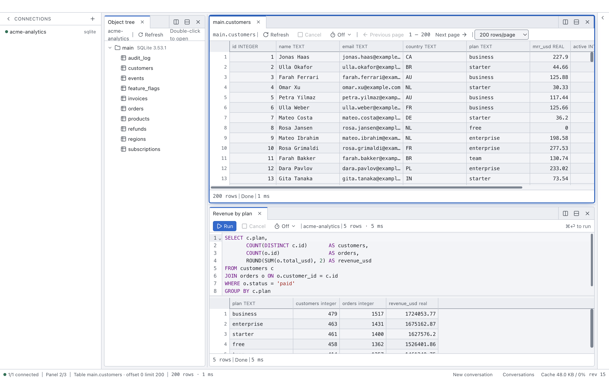
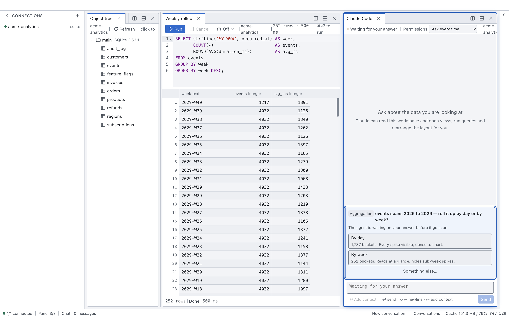

<h1 align="center">Peek</h1>

<p align="center"><b>A database viewer built for working with AI — Claude drives the same window you're looking at.</b></p>

<p align="center">
  <a href="./LICENSE"></a>
  
  = 22">
  
</p>

<p align="center"><b>English</b> · <a href="./README.zh-CN.md">中文</a></p>

<picture>
  <source media="(prefers-color-scheme: dark)" srcset="docs/images/overview-dark.png">
  
</picture>

<sub>Every screenshot in this README was produced by a single `set_layout` MCP call — see
[`apps/desktop/scripts/screenshot.mjs`](apps/desktop/scripts/screenshot.mjs).</sub>

Peek is a desktop database GUI that doubles as an MCP server. Ask Claude to open a table, run a
query, or arrange panels for comparison — it happens in the window in front of you, because AI tool
calls and your own clicks share one command channel. A built-in chat panel runs Claude Code inside
the app, so the agent you talk to drives the window it lives in.

## Features

- 🤝 **One UI for human and AI** — every click and every MCP tool call is a Command on the same bus; no shadow state, no sync step
- 💬 **Claude Code built in** — the chat panel hosts it over [ACP](https://agentclientprotocol.com), wired back to Peek's own MCP server
- 🛠️ **16 MCP tools** — connect, introspect schemas, run queries, open views, control the layout, notify, ask the user
- 🔒 **Read-only, enforced by the server** — read-only transactions and flags, no keyword filtering anywhere
- 📎 **Data reaches the AI only when you attach it** — otherwise a query returns the model at most 20 rows
- 📦 **Databases are plugins** — six drivers load from `~/.peek/packages/<id>/`; adding one means installing a directory
- ⚡ **A million rows scroll** — 0 dropped frames, ~0.5 s launch, 6.3 MB bundles ([Performance](#performance))
- 🔑 **Passwords live in the OS keychain** — never plaintext on disk

**Databases:** PostgreSQL · MySQL · SQLite · Redis · Qdrant · Neo4j

## Install

Download `Peek-v0.0.1-macos-arm64.zip` from
[Releases](https://github.com/Gyangu/Peek/releases), unzip, and drop `Peek.app` into
Applications. Apple Silicon only for now.

> **This build is ad-hoc signed** (no Developer ID yet), so macOS will refuse the downloaded app
> as "damaged" on first launch. Clear the quarantine flag once and it opens normally:
>
> ```bash
> xattr -d com.apple.quarantine /Applications/Peek.app
> ```
>
> Alternatively: System Settings → Privacy & Security → "Open Anyway". A signed and notarized
> build is planned.

## Quick start

Requirements: **Node ≥ 22**, **pnpm 10.32.1** (pinned via `packageManager`), and a database to
point at. Developed and tested on macOS / Apple Silicon only so far.

```bash
pnpm install
pnpm dev              # opens the window; MCP server on port 7332
pnpm build            # production bundles into apps/desktop/out
```

In the app: pick a driver in the sidebar, paste a connection string, and browse. Connections that
complete a handshake are saved automatically (passwords go to the OS keychain). Tables open as
virtualized grids, SQL runs in a CodeMirror editor with `⌘⏎`, panels split with `⌘\` / `⌘⇧\`, and
every result view has a cancel button backed by a real deadline.

### Tests

```bash
pnpm -r typecheck     # strict TS across every package
pnpm -r test          # 2567 tests; driver suites need real servers (see below)
```

The desktop suite is pure logic and needs nothing. Each driver suite is an integration suite that
reads its target from the environment and skips itself when the server is unreachable:

```bash
PEEK_TEST_PG_URL="postgresql://user@localhost:5432/your_db" \
PEEK_TEST_REDIS_URL="redis://localhost:6379" \
PEEK_TEST_QDRANT_URL="http://localhost:6333" \
PEEK_TEST_MYSQL_URL="mysql://root:pw@localhost:3306/peek_test" \
PEEK_TEST_NEO4J_URL="bolt://localhost:7687" PEEK_TEST_NEO4J_PASSWORD="…" \
pnpm -r test
```

Caveats: the Redis / Qdrant / MySQL / SQLite suites create and clean up their own fixtures; the
PostgreSQL suite currently asserts against a specific development database (self-provisioning is a
TODO); Neo4j always needs an explicit password. There is also an end-to-end smoke test of the built
app ([`smoke-drivers.mjs`](apps/desktop/scripts/smoke-drivers.mjs)) that drives every configured
driver over MCP.

## Using it from Claude Code

Peek starts its MCP server on launch (loopback only, bearer-token authenticated) and writes the
endpoint to `~/.peek/mcp.json` (mode `0600`). Register once:

```bash
claude mcp add peek --transport http http://127.0.0.1:7332/mcp \
  --header "Authorization: Bearer <token from ~/.peek/mcp.json>"
```

The exact command, token filled in, is one click away in **Settings → MCP endpoint**, which is also
where you change the port or rotate the token.

### The tools

| Tool | Purpose |
| --- | --- |
| `read_workspace` | See the current UI: layout, tabs, result status, connections. Never returns row data. |
| `list_connections` | Every connection with driver, status, and capabilities; secrets masked. |
| `connect` | Open a database connection. |
| `introspect` | Expand the namespace tree (db → schema → table); returns the refs `open_view` needs. |
| `open_view` | Put a view on screen: `table`, `query`, `inspector`, `tree`, `vector`. |
| `run_query` | Execute a statement. The AI gets the first 20 rows plus the count; the full result stays in the UI. |
| `set_layout` | Declare the whole panel tree in one call — several views side by side for comparison. |
| `set_ratio` | Resize one split, like dragging a divider. |
| `move_view` | Move one view to another panel, as a tab or a split. |
| `activate_view` | Bring a background tab to the front. |
| `cancel_query` | Stop a running query. |
| `send_chat` / `read_chat` / `control_chat` | Drive the chat panel from outside: send messages, read the transcript, manage the session. |
| `notify` | Notify the user, even when Peek is not the frontmost window. |
| `ask` | Ask the user a multiple-choice question and wait for the answer. |

There is deliberately no tool that hands a full result set to the model.

### The chat panel

<picture>
  <source media="(prefers-color-scheme: dark)" srcset="docs/images/agent-asks-dark.png">
  
</picture>

<sub>An `ask` call, suspended until the human answers — agents cannot answer their own questions.</sub>

You don't have to bring your own client: Peek hosts Claude Code itself, as a tab. The embedded
agent starts with no file tools, no shell, and no MCP servers other than Peek's own — it does not
inherit your `settings.json`, `CLAUDE.md`, or configured MCP servers, and
[`verify-chat-security.mjs`](apps/desktop/scripts/verify-chat-security.mjs) checks that against the
real agent. Two settings (both off by default) let you opt back in: file/command tools, and MCP
servers of your own. Each explains its cost next to the switch — see
[Security model](#security-model).

## Security model

- **MCP server:** loopback only, `Authorization: Bearer` required, `Host`/`Origin` checked against
  DNS rebinding, token compared in constant time and never logged.
- **Read-only:** enforced by the database server wherever one can (transactions, flags); Redis and
  Qdrant drivers simply issue no write command. One gap: a pre-existing stored procedure that opens
  its own read-write transaction — use a read-only database account for anything you care about.
- **Process isolation:** drivers run in one child process per connection; a wedged query or a crash
  cannot take the window down, and killing the process is an unconditional cancel. Package code
  never runs in the main process.
- **Packages are trusted, not sandboxed.** What you install is what you trust — the same deal as a
  VS Code extension or an MCP server. Peek validates a package's manifest shape, isolates its
  processes, and strips credentials from their environment, but there is no signature check and no
  sandbox. Details in the design docs.
- **Enabling the agent's file tools has a real cost:** an agent that can read
  `~/.peek/mcp.json` holds the bearer token, and permission prompts stop being a barrier. The
  settings panel says exactly this when the switch is on.

## Performance

Measured on an Apple M2 Max (macOS, 120 Hz Retina) against a generated 1,000,000-row SQLite
fixture, by two reproducible benchmark scripts
([`bench-startup.mjs`](apps/desktop/scripts/bench-startup.mjs),
[`bench-scroll.mjs`](apps/desktop/scripts/bench-scroll.mjs)):

| Scenario | Result |
| --- | --- |
| Launch → window ready (warm) | median **518 ms** |
| Scrolling 1,000,000 rows, 600 frames | **0** dropped frames |
| DOM elements in the grid at 1,000,000 rows | **< 400** (bounded by the viewport, not the data) |
| `run_query` over 1,000,000 rows, end to end | **2.1 s** |
| Built bundles | **6.3 MB** total |

Results stream as columnar chunks with backpressure and an LRU cache, and the virtual scrolling is
hand-written because Chromium silently clamps element heights around 699,000 rows at Retina
resolution — no DOM dimension in Peek is derived from the row count.

## Status and limitations

Early but real: all six databases connect, introspect, and stream rows; the layout, chat, MCP
surface, and package system described above are implemented and tested. `pnpm build` produces
bundles, and [`package-mac.mjs`](apps/desktop/scripts/package-mac.mjs) produces a macOS `.app`;
there is no signed installer yet. Writes are deliberately out of scope until the read-only path has
fully stabilized.

Known limitations, briefly (details in [`docs/PLAN.md`](docs/PLAN.md) and `docs/design/`):

- A large query pauses (by design) at ~200k rows until you scroll further; rows evicted from the
  ~200 MB cache can't be re-fetched in place — re-run the query.
- Fixed 24 px row height; large values open in a modal.
- Accessibility is solid at the layout level (ARIA tablists, roving tabindex, focus management) but
  minimal inside panel bodies, and unverified against a real screen reader.
- A restored workspace reopens layout, tabs, and editor text, but never re-runs queries.
- Qdrant: no query cancellation (the API offers none — the button says so), and table headers can't
  sort yet.
- Stored credentials are as private as your OS user account; binary signing lands with the first
  published build.

## Repository layout

```
peek/
├─ packages/
│  ├─ core/           # command schemas, workspace types, capability + chunk protocol, driver-host runtime
│  ├─ db-postgres/    # PostgreSQL driver
│  ├─ db-sql/         # MySQL + SQLite behind one dialect layer
│  ├─ db-redis/       # Redis driver
│  ├─ db-qdrant/      # Qdrant driver
│  └─ db-neo4j/       # Neo4j driver, plus the `graph` view kind
├─ apps/desktop/      # Electron app: main / preload / renderer, plus scripts/ (benchmarks, smoke tests)
└─ docs/              # PLAN.md (design record) and docs/design/ (per-change design docs)
```

[`docs/PLAN.md`](docs/PLAN.md) is the authoritative design record — architecture decisions, the
performance budget, and milestone definitions ([`PLAN.zh-CN.md`](docs/PLAN.zh-CN.md) is the Chinese
original). Per-change design docs live in `docs/design/`.

## License

MIT. See [`LICENSE`](./LICENSE).
