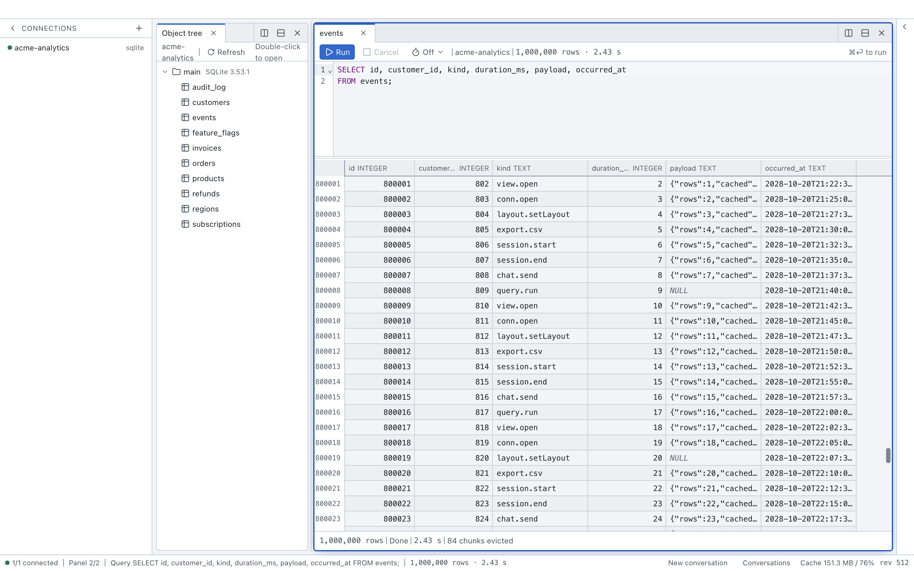

# peek

A standalone database viewer that also exposes itself as an MCP server, so an AI can drive the
interface a human is looking at.

**English** · [中文](./README.zh-CN.md)

Human clicks and MCP tool calls travel the **same command channel**. There is no second write path,
no shadow state for the AI, and no reconciliation step: the main process holds the one source of
truth, every mutation is a Command, and the renderer only ever receives patches. Ask Claude to open
a table and the panel appears on screen; open it yourself and the AI sees the same workspace on its
next read.

<picture>
  <source media="(prefers-color-scheme: dark)" srcset="docs/images/overview-dark.png">
  
</picture>

<sub>Every screenshot in this README is one `set_layout` call — see
[`apps/desktop/scripts/screenshot.mjs`](apps/desktop/scripts/screenshot.mjs), which drives the built
app over its own MCP endpoint the way an AI client would.</sub>

## Why peek

- **The agent drives the window it is sitting in.** Claude Code runs embedded over ACP as a sixth
  kind of view, connected back to peek's own MCP server.
- **Adding a database peek has never heard of is installing a directory, not editing this
  repository.** All six drivers load from `~/.peek/packages/<id>/` rather than being compiled in.
- **Read-only is enforced by the server, not by a keyword filter.** PostgreSQL and MySQL run inside
  a read-only transaction, SQLite is opened with the read-only flag plus `PRAGMA query_only`. There
  is no client-side keyword allowlist anywhere.
- **Result rows reach the agent only as an explicit attachment the human stages** — a cell, a row
  selection, a view — never as ambient context.
- **Layout is state.** The tiled tree is real state driven by Commands, so `set_layout` from an MCP
  client and a dragged divider are the same operation.
- **A million rows scroll.** No DOM dimension is derived from the row count: a spacer sized
  `rowCount × rowHeight` is silently clamped by Chromium at about 699,000 rows, past which rows are
  not slow, they are unreachable.
- **Credentials never land in plaintext on disk.** They are encrypted by the OS keychain through
  Electron's `safeStorage`, stored apart from the config that names the server.

---

## Architecture

### Process model

```
┌────────────────────────────────────────────────────────────────┐
│ renderer (React 19)                                            │
│   tiled panels · virtualized grid · tree · inspector · editor  │
│   mirror store — a read-only replica, never edited locally     │
└────────▲──────────────────────────────────┬────────────────────┘
         │ state patches (IPC)              │ user intent → Command (IPC)
┌────────┴──────────────────────────────────▼────────────────────┐
│ main                                                           │
│   Command Bus  ◄────  MCP HTTP server (127.0.0.1:7332)         │
│   Workspace Store — the source of truth, immer patches out     │
│   Connection Manager                                           │
└────────┬───────────────────────────────────────────────────────┘
         │ spawn + control: one utilityProcess per connection
┌────────▼───────────────────────────────────────────────────────┐
│ driver host (utilityProcess)                                   │
│   driver instance · query execution · server-side cursors      │
│   result chunks ─────── MessagePort, direct ──────► renderer   │
└────────────────────────────────────────────────────────────────┘
```

Three properties fall out of that shape:

- **Drivers run out of process.** One `utilityProcess` per connection. A wedged query or a driver
  crash cannot take the window down, and killing the process is an unconditional cancel.
- **The control plane goes through main; the data plane does not.** Commands and state patches pass
  through main. Result chunks travel a `MessagePort` handed directly from the driver host to the
  renderer — once transferred, main's end is neutered, so it *cannot* intercept a data frame even in
  principle. That is the physical guarantee behind "no double serialization hop for large results".
- **MCP read tools read main's store directly**, with zero renderer round-trips.

### Command Bus

```
  human clicks  ─┐
                 ├─► Command Bus ─► zod validation ─► handler (pure) ─► patch broadcast ─► result
  MCP tool call ─┘         │
                           └─► command log (source: ui | mcp | system)
```

Every state change is a Command named `domain.verb` — `conn.open`, `view.open`, `query.run`,
`layout.split`, and so on. Handlers are pure reducers over the workspace draft; side effects are
returned as plans and executed afterwards. An MCP tool is therefore a thin shell: declare an input
schema, map it to one or more Commands, render the outcome. The command log records the `source` of
each entry, which makes a session both auditable and replayable.

### Capability model

peek does not flatten every database into a lowest common denominator. Each driver advertises what
it can do, and both the UI and the MCP tools adapt:

```
introspect · tabularQuery · collectionScan · keyValue · vectorSearch · valuePeek · cancel

postgres      introspect · tabularQuery · collectionScan · valuePeek · cancel
mysql/sqlite  same, via a shared dialect layer
redis         introspect · collectionScan · keyValue · valuePeek · cancel
qdrant        introspect · collectionScan · vectorSearch · valuePeek
```

Qdrant declines `cancel` rather than pretending: it has no server-side statement cancellation, and
the REST client offers no per-request abort, so the driver can only stop between pages. A capability
is a promise about what the UI may offer, which is why "can stop at a page boundary" is not allowed
to pass as the same thing.

Adding a database is a package and **no** line of peek: the driver id, the connect form, the
capability set, the view kinds and the MCP tools all come out of the package's own
`peek-package.json` at load time, so a database peek has never heard of reaches the picker by being
copied into `~/.peek/packages/`. It used to be "a package plus a line" — one entry in
`connections/registry.ts`, one in the `drivers` array of `driver-host/entry.ts`, and five more
elsewhere — and those tables are gone. Nothing in `packages/core` changed to admit Redis, Qdrant,
MySQL, SQLite or Neo4j; the known gaps that surfaced while proving that are listed under
[Known limitations](#known-limitations).

The per-driver table is what the UI predicts *before* a connection exists; once connected, the
session's own capability set wins, so an older server can advertise less.

Capabilities are answered at three grains, because "can this driver sort?" turned out to be the
wrong question:

- **Per driver** — the table above. Enough to decide whether to draw a SQL editor at all.
- **Per collection** — `CollectionSchemaInfo.browse` lets a driver narrow the answer for one
  collection: which columns are sortable, which are filterable, and whether sorting gives up paging.
  Qdrant reports exactly the payload keys that carry an index, so ordering by an unindexed key is a
  named `BAD_REQUEST` from peek instead of a 400 from the server. A Redis keyspace has no global
  order and says so, so it draws inert headers and a forward-only pager. This grain is answered to
  MCP callers but does not yet reach the renderer, which is why a qdrant table view also draws inert
  headers — see [Known limitations](#known-limitations).
- **Per value** — `core/values.ts` fixes one canonical JS representation per `LogicalType`, and all
  four drivers are asserted against it on a real server. Two bugs fell out of writing it down: a
  PostgreSQL `BIGINT 1` used to arrive as the string `"1"` while MySQL and SQLite sent the number,
  so the same column right-aligned in one connection and left-aligned in the next; and a `DATE`
  arrived as a `Date` at *local* midnight, which serializes to the previous day anywhere east of
  Greenwich. Dates, times, timestamps and intervals are now strings everywhere, and a 64-bit integer
  is a `number` while that is exact and a decimal string once it is not.

`FilterSpec` carries a `target` for the same reason: on a relational table a filter names a column,
while on a schemaless collection it names a payload *field* that may not be in the result at all. A
Qdrant scan returns `id` plus one `payload` JSON column, so by default only `id` is filterable — but
project a payload key into a column with `columns` and the driver reports it as filterable. The
answer to "can I click this header to filter?" is now something the type system can state.

### Chunk streaming and backpressure

Result sets are streamed as columnar frames, never materialized whole:

```ts
{ resultId, seq, schema?: ColumnDef[],  // schema on seq 0 only
  cols: unknown[][],                    // column-major, ready for Arrow later
  rowCount: number,
  done?: { rows, elapsedMs, truncated?, nextCursor? } }
```

- PostgreSQL rows come off a server-side `DECLARE` / `FETCH FORWARD` cursor, 500–2000 rows per
  frame, targeting 256KB–1MB.
- The renderer keeps frames exactly as received and binary-searches `(row, col)` — no pivot to row
  objects, no copy.
- Cache ceiling ~200MB with **LRU eviction**; chunks near the viewport (±3000 rows) are protected.
- **Backpressure** is an ack window: the host pauses once 4 frames are unacknowledged, and the
  renderer withholds the ack when the cache is near its ceiling or the viewport has fallen more than
  200,000 rows behind. Scrolling releases it. A stream held this way reports `paused`, which is a
  terminal-but-healthy state — the rows already loaded are valid.
- **`elapsedMs` is the query's time, not a wall clock.** A stream parks while it waits on its reader,
  and the host subtracts every parked interval before reporting, so the duration beside a row count
  is what producing those rows cost. A million rows that took 40 s of scrolling to walk through
  report `2.4 s`.
- Values over 4KB arrive as a truncated preview carrying a ref; the full value is fetched on demand
  through `valuePeek`.

---

## Quick start

Requirements: **Node >= 22** (developed on 26.2), **pnpm 10.32.1** (pinned via `packageManager`), and
at least one database to point at. Development and testing have happened on macOS / Apple Silicon
only; nothing in the code is platform-specific, but no other platform has been exercised.

```bash
pnpm install          # pnpm 10 blocks install scripts by default; electron/esbuild/rollup are
                      # allow-listed in pnpm-workspace.yaml, so no extra approval step is needed

pnpm dev              # electron-vite dev: opens the window, renderer HMR, MCP server on 7332
pnpm build            # production bundles into apps/desktop/out (main / preload / renderer)
pnpm -r typecheck     # tsc --noEmit across every package; strict mode, no `any`
pnpm -r test          # node:test, 2567 tests today (2097 desktop + 165 core + 60 postgres
                      #                       + 41 redis + 38 qdrant + 83 mysql/sqlite + 83 neo4j)
```

The desktop suite is pure logic — no Electron, no database. Each driver suite is an integration
suite that talks to a real server, and each reads its target from the environment:

```bash
PEEK_TEST_PG_URL="postgresql://user@localhost:5432/your_db" \
PEEK_TEST_REDIS_URL="redis://localhost:6379" \
PEEK_TEST_QDRANT_URL="http://localhost:6333" \
PEEK_TEST_MYSQL_URL="mysql://root:pw@localhost:3306/peek_test" \
PEEK_TEST_NEO4J_URL="bolt://localhost:7687" PEEK_TEST_NEO4J_PASSWORD="…" \
pnpm -r test
```

Neo4j is the one that needs a password rather than a URL alone, and it has **no default**. That is
deliberate: Neo4j rate-limits failed authentication, so a suite that guessed at a password would
make the *next*, correct attempt fail too. A throwaway server is one line:

```bash
docker run -d --rm --name peek-test-neo4j -p 7687:7687 -e NEO4J_AUTH=neo4j/peektest123 neo4j:5
```

The Redis, Qdrant and SQL suites provision and remove their own fixtures (all Redis keys under a
`peek:test:` prefix, a `peek_test_*` Qdrant collection, throwaway MySQL tables, a temp-directory
SQLite file) and skip themselves entirely when the server is unreachable, so an absent service is
never a failure.

There is also an end-to-end check that no unit test can stand in for, because it launches the built
app rather than importing source:

```bash
pnpm --filter @peek/desktop build
node apps/desktop/scripts/smoke-drivers.mjs
```

It starts Electron on a throwaway port, user-data directory and config directory — so an installed
peek neither blocks it nor is disturbed by it — then drives its MCP endpoint the way an AI client
would: `connect`, `introspect`, then `open_view` on the first thing the tree says is openable, for
every driver whose `PEEK_TEST_*` variable is set. That path covers what unit tests cannot: that
`driver-host.js` resolves every driver package, that no two drivers fight over `process.parentPort`,
and that chunks reach the renderer over the MessagePort.

Two caveats worth knowing before you run it. Every statement it issues is read-only, so it is safe
against a live database — row counts are measured against the server's own `count(*)` rather than
hard-coded, precisely because the development database keeps changing underneath. But the schema is
*not* discovered: the suite asserts on specific tables in the `public` schema of one particular
development database, so pointing `PEEK_TEST_PG_URL` at an arbitrary database will fail those
assertions — and so does leaving it *unset*, because the fallback in the test file is a different
database again. Making the fixture self-provisioning is open work; until then, PostgreSQL is the one
suite that needs its variable set even to fail honestly.

Neo4j has a smaller version of the same requirement: the smoke check walks the namespace tree and
opens the first thing carrying a ref, so an **empty** database has nothing to open and the row
fails. A throwaway server started with the `docker run` line above is empty, so seed it once:

```bash
docker exec peek-test-neo4j cypher-shell -u neo4j -p peektest123 \
  "CREATE (a:PeekSmoke {name:'Ada'})-[:PEEK_SMOKE_KNOWS]->(b:PeekSmoke {name:'Bob'})"
```

Neo4j is also the only row that opens a **second** view — a `graph`, the one package-contributed view
kind in the tree. That step is what exercises the Tier C seam end to end: `view.open` accepting a
spec the kernel has no schema for, the registration composing Cypher inside the main process, and
the result arriving through the same machinery a table's scan uses.

The chat panel's security claims have their own runnable check, for the same reason: a sentence in a
comment saying "the agent inherits none of your Claude Code configuration" is a sentence that
quietly stops being true.

```bash
node apps/desktop/scripts/verify-chat-security.mjs             # spends tokens: four real model turns
node apps/desktop/scripts/verify-chat-security.mjs --offline   # free, CI-safe, skips the model
```

It verifies the shape of the session sandbox, that every tool on the wire comes from a tool file in
this repository, that a prompt asking for a shell gets no shell, that a database cell phrased as an
order is not obeyed, that the bearer token reaches neither the transcript nor stdout, and that the
agent's own tool calls come back through peek's MCP server. Exit code 0 means every check that ran
passed. The online mode deliberately does *not* isolate your own Claude Code configuration — the
whole point is that your real settings do not leak into the session, and isolating them would test
nothing.

---

## Using the app

The window is a normal database GUI, and nothing about it is AI-specific:

- **Connect** from the sidebar. Pick a driver, paste a connection string, and the namespace tree
  opens with it. The tree is lazily loaded a level at a time and cached until you refresh it. A
  connection that works is remembered under **Saved** — there is no "save" button, because the only
  thing worth remembering is a connection that has actually completed a handshake. Each saved entry
  says whether its password is in the system keychain, and can be reconnected, edited or forgotten.
  If the keychain is unavailable, peek says so and saves no password rather than writing one to disk.
- **Stop a query** with the cancel button in any result view. If the driver cannot cancel — Qdrant is
  the one that cannot, and says so rather than pretending — the button is disabled with the reason on
  it. Nothing runs forever regardless: every fetch has a deadline behind it.
- **See what went wrong** from the badge in the status bar. It counts errors and opens a panel with
  the last hundred, each copyable, so a toast that faded while you were reading rows is still there.
- **Browse a table** by clicking it in the tree: a virtualized grid, scrollable to the last row of a
  million-row table. Shift-drag the scrollbar for 10× precision, Option-drag for 50×.
- **Write SQL** in a query view. `⌘⏎` runs the statement; the editor is CodeMirror 6 with SQL syntax.
- **Inspect a value** by double-clicking a cell; a truncated one opens on a single click and pulls
  the rest through `valuePeek`. Anything over 4KB only ever travels as a preview until you ask for
  it.
- **Arrange panels** with `⌘\` (split left/right) and `⌘⇧\` (split top/bottom). Drag a divider to
  resize; the ratio is committed on release as a `layout.setRatio` command.
- **Work in tabs.** Opening a view puts it in the focused panel as a new tab rather than replacing
  what is there, so clicking a second table no longer costs you the first one. `⌘W` closes the
  active tab and the panel stays behind, empty; `⌘⇧W` closes the panel itself. When a tab closes,
  its right neighbour takes over, else its left — never a jump to the front. A panel holds 12 tabs
  at most.
- **Move a view** by dragging a tab. The centre of a panel body stacks the view there as a new tab;
  the four edges split that panel and drop the view into the new half; the tab strip inserts it at
  the caret, which is also how you reorder tabs inside one panel. Nothing is ever closed or swapped
  by a drag. `Esc`, or releasing outside any panel, cancels. Nothing moves until the main process
  has applied the command — the preview you see while dragging is only a preview.
- **Without the mouse**: `⌘1`–`⌘8` show the Nth tab and `⌘9` the last one, `⌃Tab` / `⌃⇧Tab` cycle
  through them, and `⌘⌥1`–`⌘⌥9` focus a panel by its visual order. `⌘⌥←↑↓→` moves the focus,
  `⌘⇧←↑↓→` moves the focused view into the neighbouring panel as a tab, and `⌘⌥⇧←↑↓→` sends it
  into a new panel beyond that neighbour. Inside a tab strip, `←`/`→` move between tabs and switch
  as they go, `Home`/`End` jump to the ends, and `Delete`/`Backspace` close a tab. While the SQL
  editor has focus the arrow shortcuts are left to it — `Esc` is the way back out.
- **Switch language** in the status bar. English is the default everywhere, deliberately: the window
  is a surface shared with an AI and with bug reports, so it should read the same on every machine.

---

## Using it from Claude Code

<picture>
  <source media="(prefers-color-scheme: dark)" srcset="docs/images/agent-asks-dark.png">
  
</picture>

<sub>An `ask` call, suspended. The client that made it is
[`screenshot.mjs`](apps/desktop/scripts/screenshot.mjs) — the tool call is really waiting, and the
shot ends by clicking one of the options, because `chat.answer` refuses `source: 'agent'`: an agent
answering its own question manufactures consent. No agent backend runs here, so this needs no API
key and reproduces on a fresh clone.</sub>

peek starts its MCP server on launch, binds the loopback address only, and writes the endpoint plus a
bearer token to `~/.peek/mcp.json` (file `0600`, directory `0700`). The token is reused across
restarts, so a client registered once stays registered.

```bash
cat ~/.peek/mcp.json        # the "hint" field is the exact command below, token filled in

claude mcp add peek --transport http http://127.0.0.1:7332/mcp \
  --header "Authorization: Bearer <token from ~/.peek/mcp.json>"
```

The same command is one click away in the app: **Settings → MCP endpoint** (the gear in the sidebar)
shows the status, the address and the token — masked by default — and copies the registration line
for you. It is also where the port is changed and the token rotated; both warn that an already
registered client has to be re-registered, because both invalidate it.

The token is deliberately **not** printed to the log. It grants full control of the window and of
every database connection open in it, and stdout is not a private place: terminal scrollback, CI
logs and crash reports all carry it onward. The two places that hold the copyable command are the
ones that are actually access controlled — the `0600` file and the settings panel.

The `Authorization` header is required — without it every request is rejected with 401. Requests are
additionally checked for a loopback `Host` and `Origin` (DNS-rebinding protection), and the token is
compared in constant time.

If port 7332 is busy, peek tries the next eight and tells you where it landed rather than starting
without an MCP server; the port it settled on is what `~/.peek/mcp.json` records. A port chosen in
the settings panel is remembered in `~/.peek/settings.json`. `PEEK_MCP_PORT` still overrides both,
but only for that run — an integration knob, not a preference, so a scripted launch never rewrites
what the user chose.

On first launch — no connection, and nothing in the connection book — the window shows a three-step
guide instead of an empty grid: connect a database, copy the MCP registration command, open the chat
panel.

### The sixteen tools

| Tool | Kind | Purpose |
| --- | --- | --- |
| `read_workspace` | read | See the current UI: layout tree, every tab of every panel in tab order with the visible one marked, per-result row counts and status, connections. Mounted is not the same as on screen — a panel shows one of its tabs. Never returns row data. |
| `list_connections` | read | Every connection with its id, driver, status, actual capability set, and its target masked by the rules that connection's package declares — see [Packages and trust](#packages-and-trust). |
| `connect` | command | Open a connection (`conn.open`); optionally opens a namespace tree view at the same time. |
| `introspect` | read | Expand the namespace tree (db → schema → table), up to 3 levels at a time. Returns the `ref` values `open_view` needs. Not a Command — it is a read-only driver-host RPC. |
| `open_view` | command | Put a view on screen (`view.open`): `table`, `query`, `inspector`, `tree`, `vector`. Appends it to the target panel as a new tab and shows it; `replace: true` closes that panel's visible view and takes its tab position instead. Opening in a *new panel* is `set_layout`, or `move_view` onto an edge. |
| `run_query` | command | Execute a statement (`query.run`). The AI receives the first 20 rows plus the total count; the full result stays in the UI for the human to scroll. Defaults to a 200,000-row ceiling, marked `truncated`. |
| `set_layout` | command | Declare the whole panel tree at once (`layout.setLayout`) — the way to arrange several views for comparison in a single call. Each leaf carries a `viewIds` list plus an `activeViewId`, and may also `open` new views inline, naming one of them with `activeOpenIndex`: four views side by side is four leaves, four views paged in one pane is one leaf with four `viewIds`. Caps: 16 panels, depth 6, 12 tabs per panel, each view at most once in the whole tree. A tree that leaves open views out is refused until `unplaced` says which of `close` / `keep` / `error` was meant; `expectRev` makes the write fail rather than clobber a concurrent human edit. |
| `set_ratio` | command | Resize one split (`layout.setRatio`) — the drag of a divider, as a call. For a layout that is already right and only mis-proportioned, this is what `set_layout` costs a whole tree to do. Ratios are normalized, so `[65,35]` and `[0.65,0.35]` are one request. |
| `move_view` | command | Move one view to one panel, without resending the tree. `zone: center` stacks it there as a tab (`layout.moveView`), optionally at an `index`; `left`/`right`/`top`/`bottom` split the target panel (`layout.splitWithView`). Naming the panel a view is already in is a tab reorder, not a no-op. This is the same zone→command mapping the drag UI uses, so an AI's gesture and a human's produce identical results. |
| `activate_view` | command | Bring one of a panel's tabs to the front (`view.activate`), the way clicking its tab does. Opens, closes, moves and reorders nothing. This is the answer when `read_workspace` shows the view you want with `"visible": false`. |
| `cancel_query` | command | Stop a query that is already running (`query.cancel`). Distinct from `run_query`'s `timeoutMs`, which sets a deadline up front, and from `waitMs`, which only bounds how long the caller watches. |
| `send_chat` | command | Post a message into a chat view (`chat.send`), opening one if none is named. Attachments are named by descriptor, not inlined. |
| `read_chat` | read | Read a chat view's transcript back: messages, tool calls, plans, and any permission request still waiting on a human. |
| `control_chat` | command | The chat lifecycle that is not "send": cancel the turn, clear the transcript, detach the agent, set the mode, answer a permission prompt. |
| `notify` | command | Tell the user something that reaches them when peek is not the window in front (`app.notify`): a system notification when they are elsewhere, an in-app message when they are not. |
| `ask` | command | Put a question to the user with two to four answers and **wait** for the reply (`chat.ask`). The prompt appears in a chat panel, peek always adds a free-text box, and the answer returns as the tool result — so the agent keeps working in the same turn. The only tool that suspends until a person acts. |

There is deliberately no tool that hands a full result set to the model. Layout changes go through
the same Command Bus as the human's keyboard and mouse, so `read_workspace` always shows an AI the
panel arrangement a human just dragged into place, and vice versa.

### The chat panel

You do not have to bring your own client. peek can host Claude Code itself, as a tab:

```
  chat view (renderer)
        │  chat.send / chat.cancel / chat.respondPermission  — ordinary Commands
        ▼
  Command Bus ──► ACP client (main) ──► claude-agent-acp (child process)
                                              │
                                              └── MCP ──► peek's own server on 127.0.0.1:7332
```

The agent is a child process speaking the [Agent Client Protocol](https://agentclientprotocol.com),
launched lazily the first time a chat view is used, and handed peek's own MCP endpoint on the way
up. So it closes the loop: the model you are talking to in the panel drives the panels around it
through exactly the tools above, and the transcript is state like any other — `read_chat` and
`control_chat` let a *second*, external client watch and steer the embedded one.

Two rules the panel does not bend:

- **Rows are attachments, never ambient context.** The agent sees result data only when a human
  stages it — a cell, a row selection, or a whole view — and each attachment is a descriptor
  resolved under a size budget at send time, not a blob pasted into the prompt.
- **Permissions are answered by the human.** A tool call the agent is not pre-authorized for
  renders as a prompt in the panel and blocks until someone answers it.

---

## Packages and trust

Every database peek can open is a directory under `~/.peek/packages/<id>/`: a `peek-package.json`
manifest, a `driver.mjs` the connection process imports, a `contrib.mjs` holding the MCP tools and
view kinds a package contributes, and an optional `ui/` for a view it draws itself. The six
databases under [What works today](#what-works-today) are exactly that — copied out of the app
bundle into that directory the first time peek starts, loaded through the same code path as anything
else there, and removable from the settings panel like anything else there.

**peek checks the shape of a package, never its contents.** The loader refuses a manifest with a
malformed id, missing English copy, a view kind that does not say how it fetches, or a tool without
a description or an object schema — and it names what is wrong rather than skipping the package
quietly. That is the whole of it. There is no signature check, no hash check, no permissions
manifest, no sandbox around the driver, and no confirmation dialog at install time.

So the boundary is a trust boundary, not a technical one: **what you install is what you trust**, the
same deal a VS Code extension or an MCP server offers. Concretely, at the moment a connection opens:

- **`driver.mjs`** runs in a driver-host child process — one per connection — with full Node and your
  own privileges. It is handed the connection config **as you typed it, password included**, because
  connecting is its job. Its environment is an allowlist (`PATH`, `HOME`, `TMPDIR`, `LANG`, `TZ` and
  a Windows block), not your shell's: `AWS_*`, `GITHUB_TOKEN`, `npm_config_*` and a proxy URL with
  credentials in it are not passed on.
- **`contrib.mjs`** runs in a package host `utilityProcess`, one per package, started on first use
  and not before. It is not given `safeStorage` — that is a main-process API, which is why the last
  bullet below is the one holding this up — and no credential-shaped variable is in its environment.
  A package cannot ask peek to decrypt the passwords of connections it does not serve.
- **`ui/`** runs in an iframe on `peek-package://<id>`, which is its own origin with its own storage,
  under a CSP whose `connect-src` is `'none'`. It cannot reach the network and cannot compose a
  statement: the only thing it may put on its one `MessagePort` is a bounded state patch.
- **The main process runs no package code at all.** That is why the second bullet is true.

None of that is a sandbox, and describing it as one would be the lie worth avoiding here. A driver
host is an ordinary Node process: it can read your files, open sockets and start programs. The split
bounds what a *mistake* reaches; it does not stop a package that means harm.

Two consequences are worth stating outright, because both used to be handled for you:

- **Masking a password in the UI is now the package's job.** Which config fields are secret is a
  `redact` block in the manifest, and peek applies it everywhere a config is shown — `list_connections`
  and `read_workspace`, the sidebar, the command log. A package that declares **no** `redact` block
  loads anyway and raises a warning in the error panel; until it declares one, its config travels to
  MCP clients and to the window verbatim, password field and all. (An explicit `{}` is a different
  statement — SQLite saying it holds no secret — and is not warned about.) This used to be an
  exhaustive `switch` in `packages/core` that could not compile with a database missing from it; a
  closed set of databases is precisely what packages ended.
- **There is no kill switch.** peek has no registry, no update channel and no revocation list, so
  nobody — including this project — can withdraw a package that turns out to be hostile from the
  machines it is already on. Vendors of comparable tools lean on centralized distribution for that
  backstop. peek's answer is local and manual: uninstall it. That closes the connections, kills the
  package's host process and deletes the directory; what the package wrote elsewhere while it ran is
  outside anything that button can speak for.

### The chat panel makes the same deal, behind two switches

Out of the box the embedded agent has no file tools, no shell, and sees peek's own MCP server and
nothing else — `settings.json`, `CLAUDE.md` and any MCP servers configured on this machine are not
inherited, and `scripts/verify-chat-security.mjs` runs a probe against the real agent to check it.
Settings → Agent has two switches that trade parts of that away. Both are off by default, both say
what they cost next to themselves, and neither shows a confirmation dialog — for the same reason
installing a package does not.

- **File and command tools.** Turns the agent's own `Read`, `Write`, `Edit` and `Bash` back on, and
  lets you point it at a working directory of your choosing. This gives up more than a tool list:
  peek's guarantee that the panel cannot approve its own permission prompts rested on the agent
  having no way to read a file, because the bearer token that carries full control of the window sits
  in `~/.peek/mcp.json` in the clear. An agent that can read that file can present that token, and a
  permission prompt becomes a notification rather than a barrier. There is no partial version of this
  — one `Read` is the whole chain — so peek offers the switch rather than a per-tool illusion, and
  the settings panel says exactly this when it is on. Note also that **`Bash` reaches your databases
  directly**, outside the read-only transaction peek's own drivers open — that guarantee only covers
  statements that travel through peek.
- **Your own MCP servers.** Adds servers you list to the panel alongside peek's own. Their tool calls
  still go through peek's permission prompt; what happens after you approve one is between the agent
  and that server, and peek can neither see it nor account for it. In particular a database MCP
  server of your own is not bound by the read-only path either — that is something peek's own drivers
  do, and it never reaches anybody else's code. Credentials you enter here are encrypted by the
  OS keychain like every other secret peek stores, and are redacted from error messages and logs.

Conversations started before you flip either switch are unaffected — a conversation is fixed to the
capabilities it was created with.

---

## Performance

Two benchmark scripts produce every number below. They launch the **built** app on a throwaway port,
user-data directory and config directory, so an installed peek neither blocks them nor is disturbed
by them:

```bash
pnpm --filter @peek/desktop build

node apps/desktop/scripts/bench-startup.mjs   # cold/warm launch, plus bundle sizes
node apps/desktop/scripts/bench-scroll.mjs    # run_query + frame timing + DOM node count
```

`bench-startup.mjs` injects a timing probe into the main process with `NODE_OPTIONS=--import`, so
the app's own source carries no instrumentation. `bench-scroll.mjs` generates its own SQLite fixture
(no database server required), drives the app over its own MCP endpoint the way an AI client would,
then attaches over CDP to scroll the grid and sample it. Both take `--json`.

Measured on an Apple M2 Max (64GB, macOS 26.1, Retina at `devicePixelRatio` 2, 120Hz), Electron
43.2, against the generated 1,000,000-row SQLite fixture:

| Scenario | Result |
| --- | --- |
| Launch → `ready-to-show`, warm | median **518ms** (min 481, p95 566) — budget is 1.5s |
| Launch → `ready-to-show`, cold (first run of a session) | **802ms** |
| Scrolling a 1,000,000-row result set, 600 frames | **0** dropped frames |
| Per-frame main-thread work while scrolling (handler + style + layout) | median **0.20ms**, p95 **0.30ms**, max **0.80ms** |
| DOM elements under `.grid-surface` | **279–369** at 1,000,000 rows, **306–396** at 200,000 |
| `run_query` over 1,000,000 rows, end to end | **2124ms** |
| Built bundles under `out/` | **6.3MB** total — 1.6MB app, 3.7MB database packages, 1.0MB render probe |

Three of those need reading carefully:

- **Frame *interval* is not a speed.** rAF-to-rAF wall time is vsync-bound, so its median is the
  refresh period by construction. What the benchmark reports instead is `droppedFrames` — intervals
  past 1.5 refresh periods — and `scrollWork`, the part the application actually controls.
- **The DOM node count is the virtual-scrolling claim, stated as a measurement.** It is bounded by
  the viewport and not by the result set: five times the rows produced no increase at all — in fact
  slightly fewer elements, because the two runs happened to render 41 and 44 rows respectively. The
  range within one run is the overscan window growing and shrinking at the ends of the scroll.
- **"End to end" assumes a reader who keeps scrolling.** Backpressure holds the stream as soon as
  the delivered rows run far enough ahead of the viewport, so a benchmark that never scrolls
  measures the pause timeout rather than the query — the first draft of this script reported
  "60,483ms, 207,000 rows" for exactly that reason. The number above is with the viewport being
  driven to the end, which is what clears the row-count gate.

### Why the virtual scrolling is hand-written

Chromium clamps the layout height of a single element to roughly `2^25` device pixels divided by
`devicePixelRatio` — 33,554,248px at dpr 1, but **16,777,214px at dpr 2** on any Retina display. At a
24px row that ceiling lands at about **699,000 rows**. A spacer element sized `rowCount × rowHeight`
is *silently* clamped there: rows past it are not slow, they are unreachable. The cap is not even a
constant, so hardcoding a safe value only moves the failure to the next external monitor or zoom
level.

<picture>
  <source media="(prefers-color-scheme: dark)" srcset="docs/images/million-rows-dark.png">
  
</picture>

peek's answer is that **no DOM dimension is derived from the row count**. The vertical offset is a
plain JavaScript number in virtual pixels; rows are positioned against a block origin that only moves
every 4096 rows, which keeps every pixel value that reaches the compositor under 100k (safely inside
float32 precision) and lets React's memoization bail out on ~99.98% of rows. The horizontal axis
stays native scrolling. The vertical scrollbar is drawn by hand, because with
`overflow-y: hidden` there is no native one to have.

---

## What works today

| Area | State |
| --- | --- |
| Databases | PostgreSQL, Redis, Qdrant, MySQL, SQLite and Neo4j, across five packages. The packages are **loaded from disk** — `~/.peek/packages/<id>/` — rather than compiled into the app; the ones peek ships with are copied there on first start and can be uninstalled like any other. The connect dialog renders a different form per driver, because they do not describe a connection the same way — a numeric database index for Redis, a base URL and API key for Qdrant, a path on disk for SQLite. Adding a database peek has never heard of is installing a directory, not editing this repository. See [Packages and trust](#packages-and-trust) for what that costs. |
| Data access | Read-only, and enforced by the server wherever a server can enforce it: PostgreSQL and MySQL run inside a read-only transaction, SQLite is opened with the read-only flag plus `PRAGMA query_only`. Redis and Qdrant have no such switch, so their drivers simply issue no write command. No client-side keyword allowlist anywhere. The one gap is a stored procedure that opens its own read-write transaction — see [Known limitations](#known-limitations). |
| Views | All six kinds are implemented: `table`, `query`, `inspector`, `tree`, `vector`, `chat`. Which ones a connection offers follows its capabilities — Redis and Qdrant have no `tabularQuery`, so no SQL editor is drawn for them; the typed key inspector appears only on Redis, and vector search only on Qdrant. `chat` is the odd one out: it is the only kind that may exist without a connection. |
| Chat / ACP | Claude Code runs as a child process behind the [Agent Client Protocol](https://agentclientprotocol.com), rendered as a chat view like any other tab — streamed assistant text, tool-call cards, plan cards, and a permission prompt the human answers. The agent is launched lazily on first use, and is handed peek's own MCP endpoint, so it drives the window it lives in. Result rows reach it only as an explicit **attachment** the human stages (a cell, a row selection, a view), never as ambient context. |
| Layout | The tiled tree is real state, driven by Commands: `⌘\` splits left/right, `⌘⇧\` splits top/bottom, `⌘W` closes the active tab, `⌘⇧W` closes the panel, and dragging a divider dispatches `layout.setRatio`. |
| Tabs | A panel holds up to 12 views as tabs and shows one. The strip is always visible, even for a single tab, so the body height never changes; past the width of the strip it scrolls sideways. Dragging a tab onto a panel body's centre stacks it there as a new tab, onto an edge splits, and onto a tab strip inserts it at the caret — which is also how tabs are reordered. Nothing is swapped by any gesture; `swap` survives only as an explicit `onOccupied` mode for callers that name it. |
| Keyboard / a11y | Panels are `role="group"` and tab strips are real ARIA `tablist`s. An empty panel emits neither `tablist` nor `tabpanel`: a tab list with no tabs, and a tab panel no tab controls, would announce a widget that is not there. Roving tabindex is per widget — one panel element (the focused one) and one tab per strip. Panel chrome is otherwise unconditionally tabbable, because the bodies beside it (CodeMirror, the grid's toolbar and pagination) cannot be taken out of the tab order, and pretending the surrounding chrome was out of it only made `Tab` walk into a body before the strip above it. DOM focus and `focusedPanel` sync both ways, with a guard that stops a remote MCP call from pulling the caret out of a dialog or the sidebar; closing a panel's last tab hands focus back to the panel rather than dropping it to the document. Changes that move focus announce themselves through role semantics; ones that do not are announced by a single polite live region. Splitter handles are not keyboard-resizable. |
| Cancel / timeouts | Every query, scan and vector search runs under a deadline (120s / 120s / 60s by default; `0` means none). A deadline that expires and an explicit `cancel_query` take the same escalation path — ask the driver, then kill its process — so a wedged connection cannot outlive either. All three result views draw the same cancel control; a driver without the `cancel` capability shows it disabled with the reason, rather than silently omitting it. |
| Errors | A status-bar badge counts what went wrong and opens a panel holding the last 100 entries, each copyable with its code and detail. Errors that used to exist only as a toast that had already faded are now recoverable after the fact. |
| MCP | 16 tools over Streamable HTTP on loopback, bearer-token authenticated. Port 7332 by default, settable and persisted; if it is taken, the next 8 are tried and the window says where it landed. |
| Persistence | Four files and three subtrees under `~/.peek`: `mcp.json` (endpoint + token), `connections.json` (the connection book), `settings.json` (the MCP port and the execution budgets), `workspace.json` (the layout and the definition of every open view), `chat/`, `logs/` — diagnostics and the command audit — and `packages/`, the installed database packages, one directory each. Credentials never land in plaintext **on disk** — they are encrypted by the OS keychain through Electron's `safeStorage` and stored apart from the config that names the server; what a loaded package is handed at connect time is a different question, answered under [Packages and trust](#packages-and-trust). The workspace stores what a view **is** (which table, which filters, the text in a query editor) and never what happened to it in a session: no cursors, no result sets, no transcripts. `PEEK_NO_RESTORE=1` starts empty and leaves the file alone. |
| Packaging | `pnpm build` emits minified bundles under `apps/desktop/out` (~6.3MB total), not an installer. `apps/desktop/scripts/package-mac.mjs` produces a macOS `.app`. |
| i18n | English is the default and is never auto-detected from the OS; a `zh-CN` catalog ships alongside it, switchable from the status bar. |

---

## Known limitations

- **A large query pauses if you do not scroll.** With backpressure active, a 1,000,000-row query
  stops at roughly 200,000 rows and reports `paused` — measured at 207,000 by `bench-scroll.mjs`
  before it learned to drive the viewport. This is the design working: loaded rows are valid,
  scrolling forward resumes the stream, and re-running the query restarts it. It is not an error
  state, but it does surprise people who expect a progress bar to reach the end on its own.
- **LRU-evicted chunks cannot be re-fetched in place.** Scroll far away in a result set larger than
  the ~200MB cache and back again, and the rows that were dropped are gone. The view now says so —
  the evicted range raises a notice with a button that re-runs the query — but it cannot quietly
  refill the hole, and that is a protocol limit rather than a missing feature: the rows came off a
  cursor that has since been closed, and `cursorToken` addresses the next page of a scan, not a
  position inside a finished result. A free-form query has no cursor at all. "Re-fetch rows *n*..*m*"
  is not a request any driver can currently be asked.
- **Only the execution budgets are settable.** Settings → Timeouts exposes the three deadlines
  anybody holds an opinion about — query, scan and vector search — and writes them to
  `settings.json` like the MCP port. The nine protocol timeouts behind them (spawn→ready, the
  connect RPC, the cancel RPC) have no form on purpose: they are the app protecting itself from a
  wedged driver process, not a preference anyone holds, and a tunable `cancelMs` can only make
  peek worse at noticing a dead one. MCP callers can still pass `timeoutMs` per call.
- **Read-only is enforced per statement, not per account.** On MySQL every checkout begins
  `ROLLBACK; SET SESSION TRANSACTION READ ONLY`, which closes every escape a client can type —
  `START TRANSACTION READ WRITE`, `BEGIN`, flipping the session variable back, `autocommit=0`, and
  XA were each tried against a real server, and only the first ever worked. What it cannot close is
  a stored procedure that *already exists in the database* and opens its own read-write transaction
  internally: `CALL` is a read-shaped statement, and the write happens on the server's side of the
  boundary. Closing that needs a MySQL account without write privileges, which is the right way to
  run peek against anything you care about.
- **A qdrant table view cannot be sorted from a column header.** The driver orders a scroll by
  indexed payload keys, and it reports which ones. That per-collection answer reaches MCP callers,
  who can still order a view with `view.update`, but it does not reach the renderer: `ViewSummary`
  carries only the kind-level style, and a table view of a vector collection draws the fixed default
  projection (`id`, `payload`), neither of which is ever an index key. So the headers are inert
  rather than offering a sort that would be `BAD_REQUEST` on every collection. Making them live
  needs a `sortableColumns` allowlist carried from `describeCollection` through the view state, and
  a grid that can make headers inert one at a time.
- **Row height is fixed at 24px.** Variable-height rows are not supported, and neither is wrapping a
  tall cell in place; large values open in a modal instead.
- **Accessibility stops at the panel body.** The layout has real semantics — panels are labelled
  groups, tab strips are ARIA `tablist`s with roving tabindex, DOM focus tracks the focused panel,
  and layout changes are announced. Inside a panel none of that is true yet: the hand-drawn
  scrollbar has no native semantics, keyboard navigation within the grid is minimal, and dividers
  cannot be resized from the keyboard. The semantics are asserted by unit tests but have **not**
  been verified against a real screen reader.
- **`VectorViewState.queryText` is inert.** Drivers are forbidden from embedding, and nothing else in
  peek turns text into a vector, so the field can be set but never consumed. Vector search is driven
  by "more like this point" (`queryPointId`), which is the only entry point a human can operate.
- **A restored desk comes back empty until its connections are up.** The layout, the tabs and the
  text in a query editor are saved and restored; the rows are not. Restoring opens the connections
  without waiting for them, so every view starts idle and fills in when its connection reports
  ready — and a query view never re-runs itself, because restoring a desk must not execute the
  statement somebody left in an editor. Result sets are memory-only by design and always will be.
- **`cursorToken` values do not survive a version change.** The token now names the driver that
  minted it (`postgres:0:400`), so a stale one — from an older build, or from another connection — is
  refused rather than replayed against the wrong store. That is the intended trade, and it is why
  `workspace.json` stores `ViewOpenSpec`s rather than view state: a spec has no field a cursor could
  live in, so a restored view starts its scan from the top instead of replaying a dead token.
- **Stored credentials are only as private as your user account.** Passwords are encrypted by the OS
  keychain and never written in the clear, which protects a `connections.json` that leaks *somewhere
  else* — a backup, a sync folder, another account on the same machine, a file pasted into an issue.
  It does not protect against code already running as you, and a hardened runtime would not change
  that: `--options runtime` was measured against this build and AMFI does not honour it without a
  trusted signing identity, so `DYLD_INSERT_LIBRARIES` still loads into peek, and the keychain ACL —
  which checks the main binary's cdhash, left untouched by an injected dylib — waves the injected
  code through as peek. Nothing detects an edited `out/main/index.js` either (`asar: false`, so
  neither integrity fuse applies). Closing this needs Developer ID signing, which arrives with the
  first published binary; the measurement is in `docs/design/2026-08-15-hardened-runtime.md`.

---

## Roadmap

> **Status: early.** M0 (skeleton), M1 (PostgreSQL read-only pipeline), M2 (tiled layout: view
> drag-and-drop plus the `set_layout` / `move_view` tools), M3 (Redis), M4 (Qdrant), M5
> (MySQL / SQLite), M6 (cancel and timeouts, error panel, connection persistence, a settable
> MCP port, and the capability-model gaps closed), M7 (chat session management) and M8 (database
> packages loaded from disk, plus an Electron hardening pass) are complete, and the layout has
> since grown panel tabs and keyboard accessibility. All six databases connect, introspect and
> stream rows, each from a package loaded off disk rather than compiled in
> ([Packages and trust](#packages-and-trust));
> all data access is read-only. peek has also grown a **chat panel**: Claude Code runs embedded
> over ACP as a sixth kind of view, connected back to peek's own MCP server, so the agent you are
> talking to drives the window it is sitting in. Everything below that is not marked complete is
> a plan, not a feature.

| Milestone | Scope |
| --- | --- |
| **M6** | **Complete.** Cancel and timeouts end to end, an error panel, connection persistence with keychain-backed credentials, a settable MCP port with token rotation, the capability-model gaps closed (per-collection browse style, a canonical JS representation per `LogicalType`, a cursor format that names its driver), and the build and measurement work: minified bundles, two benchmark scripts, a runnable chat-security verification, and dropping the general-purpose table engine from the grid. |
| **M7** | **Complete.** Chat session management: a persistent entry point in the status bar, a session list, history restoration and deletion. No new persistence layer for the embedded agent — `claude-agent-acp` already advertises `loadSession`, so the transcript stays in the agent's own cwd (`~/.peek/chat`) and peek stores not a byte of it; a user-configured LLM endpoint has no agent side to hold it, so that one tier peek does store itself (designs 2026-08-02, 2026-08-03). |
| **M8** | **Complete.** Database packages installed from disk, and the Electron hardening pass in the same round. `DriverId` went from a closed union to an open string, taking the number of places that adding a database touches from 15 to 7 to **zero**; the price is that those last checks became load-time validation instead of a compile error. Package code was moved out of the main process into a package host, because with no signature check what a package can touch once installed is the only thing left to tighten. Neo4j arrived here as the acceptance test — the first package to contribute a view kind of its own (`graph`). |

Of the work M6 left behind: the timeout settings have a form and a home in `settings.json`, and
**layout and open views now persist** (`workspace.json`, design 2026-08-15). What remains is a
self-provisioning PostgreSQL fixture, described under [Quick start](#quick-start).

M3 (Redis), M4 (Qdrant) and M5 (MySQL / SQLite) were the test of the capability model, and it held:
`packages/core` did not change to accommodate a key-value store or a vector database. What the
exercise surfaced is that several of core's implicit assumptions were relational — a global sort
order, an exact `limit`, a filterable field being a result column, one JS type per logical type.
M6 turned each of those into something a driver states rather than something core assumes; what
remains genuinely unsolved is listed under [Known limitations](#known-limitations).

Deferred on purpose and tracked in the plan: write operations (the read-only path stabilizes first,
then a confirmation mechanism), spilling huge result sets to disk, and an Arrow binary channel (the
chunk format is already columnar to leave room for it).

---

## Repository layout

```
peek/
├─ packages/
│  ├─ core/               # Command schemas, workspace types, capability + chunk protocol,
│  │                      # errors, and the driver-host runtime every driver shares
│  ├─ db-postgres/    # introspect · tabularQuery · collectionScan · valuePeek · cancel
│  ├─ db-redis/       # introspect · collectionScan · keyValue · valuePeek · cancel
│  ├─ db-qdrant/      # introspect · collectionScan · vectorSearch · valuePeek
│  ├─ db-sql/         # MySQL + SQLite behind one dialect layer; same set as postgres
│  └─ db-neo4j/       # same set as postgres over Cypher, plus the `graph` view kind
├─ apps/desktop/          # electron-vite: main / preload / renderer
│  ├─ scripts/           # smoke-drivers.mjs, verify-chat-security.mjs, the two bench-*.mjs,
│  │                      # macOS packaging
│  └─ src/
│     ├─ main/            # Command Bus, workspace store, connection manager, MCP server,
│     │                   # driver host, and the ACP client that hosts Claude Code
│     ├─ preload/         # one narrow bridge: invoke / onPatch / onResultPort
│     └─ renderer/        # React UI, mirror store, result cache, virtual scrolling, chat, i18n
└─ docs/PLAN.md           # design record (English; PLAN.zh-CN.md is the Chinese original)
```

`docs/PLAN.md` is the authoritative design document — architecture decisions, the performance budget
this README reports against, and the milestone definitions. It was originally written in Chinese;
that original is preserved verbatim as `docs/PLAN.zh-CN.md`, and the two are kept in sync. The
per-change design records under `docs/design/` are Chinese for everything dated before
2026-08-24 and English from that date on — see `CLAUDE.md`.

---

## License

MIT. See [`LICENSE`](./LICENSE).
